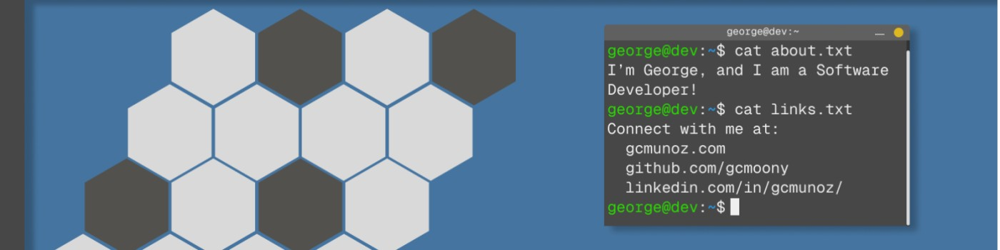

# George Munoz

Hey, hey! 👋

I'm George, a software developer. My primary career focus is web development,
but I like to work on one-off projects too.

## About Me

- 🔭 **I’m currently working on** an [inventory management application](https://github.com/gcmoony/inventory-app) using
  Electron and React.
- 🌱 **I’m currently learning** about data structures and algorithms through
  [CodePath](https://www.codepath.org/).
- 💬 **Ask me about** my favorite pizza recipe.
- 📫 **How to reach me**: george@gcmoony.com
- ⚡ **Fun fact**: Intel brought
  ["Pipe Dream" by Animusic](https://www.youtube.com/watch?v=hyCIpKAIFyo) to
  life using industrial controllers and synthesizers, taking 90 days to bring a
  concept to reality. As someone who loves music and different takes on making
  music, this is one to
  [check out!](https://www.youtube.com/watch?v=E4hjx3_A-cw)
